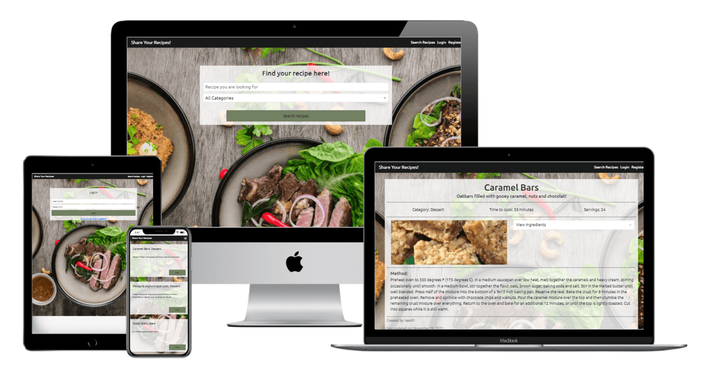

# Share your Recipes!

# Introduction

Welcome to Share Your Recipes! Here you can find all your desired recipes! 

Ranging from dessert to side dishes, all kinds of recipes can be found here at Share Your Recipes. Or if you need a digital recipe book, then this is also the place for you! Create an account and add your own recipes at will. You can even decide if you want others to see your recipes or if you want to keep them private!

Thank you for visiting this project! For any feedback and/or questions you can always contact me via GitHub!

~ Robert L. Zelhorst

# Table of Content
- [User Experience](#user-experience)
  * [Site Owner Goal](#site-owner-goal)
  * [User Goals](#user-goals)
  * [User Stories](#user-stories)
  * [User Requirements](#user-requirements)
  * [User Expectations](#user-expectations)
- [Design](#design)
  * [Wireframes](#wireframes)
  * [Design Choices](#design-choices)
    * [The Structure](#the-structure)
    * [Fonts](#fonts)
    * [Colours](#colours)
  * [Database Structure](#database-structure)
  * [Logic Flowchart](#logic-flowchart)
- [Features](#features)
  * [Existing Features](#existing-features)
  * [Future Features](#future-features)
- [Technologies](#technologies)
  * [Languages](#languages)
  * [Libraries and Tools](#libraries-and-tools)
- [Testing](#testing)
- [Deployment](#deployment)
  * []
- [Credits](#credits)
  * [Code](#code)
  * [Thanks](#thanks)
  * [Afterword](#afterword)

# User Experience
## Site Owner Goal
* Having users find, add and share recipes.
* A way to maintain all the recipes , ie an admin/superuser role.

---

## User Goals
* A website where you can find and share recipes
* A website that is easy to use on all screen sizes with appropriate responsiveness.
* A website where I can register and login to.
* Having a dashboard with all my own recipes

---

## User Stories
As a user;
* I want a website that is easy and intuitively to use.
* I want to see what the website is about at first glance.
* I want a website that works on all screen sizes.
* I want to register to the website.
* I want to login to the website.
* I want to be able to search for more specific recipes.
* I want to add my own recipes.
* I want to decide if my recipes are public or not.
* I want to change my recipes.
* I want to see in a recipe, including but not limited to;
    * Whats the recipe about, ie. Recipe title.
    * Recipe ingredients.
    * Steps to completion.
* ~~I want the recipe maker know that I cooked their dish today/liked their recipe.~~

[Back to top](#table-of-content)

---

## User Requirements
* Easy navigation.
* Intuitively know what the website is about.
* The ability to register.
* The ability to login and therefore access there own recipe dashboard.
* The ability to search for recipes.
* The ability to add/remove (own) recipes.

## User Expectation
* A user dashboard for navigation to own recipes, add or change recipes.
* An overview of all own recipes.
* A form to add/change a recipe.
* ~~The ability to filter down search parameters to find a more specific recipe.~~

[Back to top](#table-of-content)

---

# Design
## Wireframes
I have made wireframes for the sizes Mobile, Tablet and Desktop.
As per Bootstrap order, from small to large. To make the wireframes I have used the program [Balsamig Wireframes](https://balsamiq.com/wireframes/ "Link to Balsamig Wireframes").

#### Mobile Wireframes
* [Mobile Wireframe Home](/wireframes/home-mobile.png)
* [Mobile Wireframe User Dashboard](/wireframes/user-dashboard-mobile.png)
* [Mobile Wireframe Own Recipe Overview](/wireframes/own-recipes-overview-mobile.png)
* [Mobile Wireframe View Recipe](/wireframes/view-recipe-mobile.png)
#### Tablet Wireframes
* [Tablet Wireframe Home](/wireframes/home-tablet.png)
* [Tablet Wireframe User Dashboard](/wireframes/user-dashboard-tablet.png)
* [Tablet Wireframe Own Recipe Overview](/wireframes/own-recipes-overview-tablet.png)
* [Tablet Wireframe View Recipe](/wireframes/view-recipe-tablet.png)
#### Desktop Wireframes
* [Desktop Wireframe Home](/wireframes/home-desktop.png)
* [Desktop Wireframe User Dashboard](/wireframes/user-dashboard-desktop.png)
* [Desktop Wireframe Own Recipe Overview](/wireframes/own-recipes-overview-desktop.png)
* [Desktop Wireframe View Recipe](/wireframes/view-recipe-desktop.png)
#### Other Wireframes
* [Wireframe Register/Login](/wireframes/register-login.png)
* [Wireframe Add or Change Recipe](/wireframes/add-change-recipe.png)

[Back to top](#table-of-content)

## Design Choices
The goal of this site is that users can find, view and add recipes. So readability is paramount with not much other distractions.

### The structure
For the structure of the website I will use the framework [Bootstrap](https://getbootstrap.com/ "Link to bootstrap").
This framework allows for a proper responsive website which is build up from a mobile-first perspective.
The grid-system that Bootstrap provides is very usefull to have a well working responsive website.
Furthermore Bootstrap has a wide browser compatibility, is quite easy to use and is very customizable.

### Fonts
I will be using a font from [Google Fonts](https://fonts.google.com/ "Google Fonts"), specifically the [Ubuntu Font](https://fonts.google.com/specimen/Ubuntu/ "Ubuntu Font").
An easy to read, compact, professional looking font.

### Colours
I have chosen for a colour scheme that goes easy on the eyes, as most of what the user will be doing is reading the recipes. With that it is not desirable to have colours which are to bright, hampering readability.


The colour pallette exists out of 5 colours, with a mix of colour inbetween marked with a *. The * colours are only to be used if the five main colours do not fit very well.

* #375412: Dark Moss Green
* #718161: Xanadu*
* #ABADB0: Silver Chalice 
* #D5D6D8: Light Grey*
* #FFFFFF: White
* #8C8C8C: Battleship Grey*
* #191919: Eerie Black
* #97271B: Falu Red*
* #D9351C: Vermilion 

[Back to top](#table-of-content)

---

## Database Structure

#### User
Key|Value
-|-
_id|ObjectId
username|String
password|String
email|String
is_superuser|Boolean

#### Recipe
Key|Value
-|-
_id|ObjectId
recipe_name|String
recipe_category|String
recipe_description|String
servings|String
cooking_minutes|String
recipe_img|String
recipe_ingredients|Array
recipe_method|Array
is_public|Boolean
created_by|String

#### Category
Key|Value
-|-
_id|ObjectId
recipe_category|String

[Back to top](#table-of-content)

---

## Logic Flowchart

A flowchart on how the verification process of registering or logging in should proceed.


[Back to top](#table-of-content)

---

# Features
## Existing Features
### Search Function
On page load you will see a search bar and a category selector. The user can use these two parameters to find a recipe. The text input search along if there is a match with a word in the recipe title or recipe description. The category selector will show all recipes with chosen category and mentions of selected category in the recipe name and/or description. This is because a recipe could belong to multiple categories, but in the application it can only have one. But if the recipe mentions a different category in the description, it will also show up with the category selector. Selecting neither, the search function will show all recipes. If there are no recipes found, a flash message will give feedback to the user that no recipes are found.

### Registration and login function
User can also opt to register on the site, so that the user can add recipes. The registration function requires an original username, a password and an original email address, of which the username and emailaddress will be checked against the database. No multiple usernames on one email address and no multiple emailadress with the same username. Feedback will be given if the username or emailaddress is already in use. The password will be hashed with the plugin by [werkzeug](https://werkzeug.palletsprojects.com/en/2.0.x/ "Link to werkzeug."), before the combination username, password and emailaddress is saved to the database.
When trying to login, the username and password combination will be checked and compared. When wrong information is given, feedback will be suplied that the user has made a mistake, not telling if the mistake was made in the username or password. 
Both registration and logging in will create a session cookie, which contains the username.

### Log out
This will delete the session cookie and thus requiring the user to log back in, if the user wants to access its own recipes.

### Dashboard
The profile page of the user. See future features.

### CRUD
#### Create recipes
The user can, when logged in, create a recipe via Add Recipe in the navigation bar. Here the user can provide the recipe name, recipe category, a small description, an link to an external image of the dish, amount of servings, time to cook, the ingredients; seperated by a ; and the method. The user can also decide if the recipe can be seen by others by making it public or not. In addition the creation of a recipe also registers who created the recipe and when it was created.

#### Read recipes
Same as via the search function, the recipes can be viewed. Logged in user can also go to a page where they can view their own recipes, including there personal recipes.

#### Update recipes
The user can edit its own recipes. The same form as adding a recipe will be shown, but with all the fields already filled in. Which then can be altered and saved again. The recipe will then be updated to the database.

#### Delete recipe
The user can also delete its own recipes. Via either the search function or the users own recipe page, the user can press delete. A warning modal will show and confirm if the user wants to delete the recipe. It will also tell that it cannot be undone. The delete function works via a POST method and thus can not be repeatedly called via the URL.

### Superuser
A user can be flagged as a "superuser" in the database. The superuser can edit and delete all recipes.

[Back to top](#table-of-content)

## Future Features
### User Dashboard
The dashboard at the moment only confirms what the users username is. In the future this should function as the users profile page. More information about the user, number of recipes, how much the users recipes have been visited, how many recipes have received a recommendation. etc.

### Ordering
A way to order the searched/users recipes via multiple criteria. Ie newest/oldest, most viewed, most liked, etc. At the moment the recipes are order alphabetically on recipe name.

### More images
At the moment the user can only provide a single link to an external hosted image of the recipe which is then used on the recipe page. In the future there should be option to upload several images to support the recipe. Afterall a picture can convey a lot more then words. This would require a larger database.

### Delete user
A way to delete the users account.

### Change password/Forgot password
The user should be able to change its password.

### Double check password in registration
A double password check, to make sure the user has put in the password the users wants. Perhaps a recaptcha check to see if user is actually human.

### Pagination
At the moment the shown recipes will continue to show on one page. Pagination is needed to keep it all orderly and neat.

### Superuser capabilities
At the moment the superuser can edit and delete all recipes compared to a normal user. In the future the capabilities should be expanded to that the superuser can add/remove/change categories. Perhaps a moderation role as suspending users accounts in events of violation. Community roles could be considered aswell, as in marking some recipes as recipe of the week.

[Back to top](#table-of-content)

---

# Technologies
## Languages
*   [HTML](https://en.wikipedia.org/wiki/HTML "Link to the HTML wikipedia page")
*   [CSS](https://en.wikipedia.org/wiki/CSS "Link to the CSS wikipedia page")
*   [JavaScript](https://en.wikipedia.org/wiki/JavaScript "Link to the JavaScript wikipedia page")
*   [Python](https://www.python.org/ "Link to the python webpage")


## Libraries and Tools
### Libraries & Frameworks
*   [Bootstrap](https://getbootstrap.com/ "Link to bootstrap")
*   [Fontawsome](https://fontawesome.com/ "Link to fontawesome")
*   [Googlefonts](https://fonts.google.com/ "Link to googlefonts") 
*   ~~[jQuery](https://jquery.com/)~~

### Tools
*   [Gitpod](https://www.gitpod.io/ "Link to gitpod")
*   [Github](https://github.com/ "Link to github")
*   [Git](https://git-scm.com/ "Link to git")
*   [Tinypng](https://tinypng.com/ "Link to tinypng") 
*   [Balsamiq Wireframes](https://balsamiq.com/wireframes/ "Link to balsamiq wireframes")
*   [Coolors](https://coolors.co/)
*   [Contrast Checker](https://webaim.org/resources/contrastchecker/)
*   [W3C Css-validator](https://jigsaw.w3.org/css-validator/ "Link to the w3 css validator")
*   [W3C Markup-validator](https://validator.w3.org/ "Link to w3c markup validator")
*   [Python Validator](https://infoheap.com/python-lint-online/ "Link to pyhton lint validator")
*   [Techsini](http://techsini.com/ "Link to techsini.com")
*   [Favicon.cc](https://www.favicon.cc/ "Link to a favicon creator")
*   [Heroku](https://www.heroku.com/ "Link to Heroku")
*   [MongoDB Atlas](https://docs.mongodb.com/ "Link to mongoDB")
*   [Flask](https://flask.palletsprojects.com/en/2.0.x/ "Link to Flask")
*   [PyMongo](https://pymongo.readthedocs.io/en/stable/l "Link to pymongo literature")
*   [Jinja](https://jinja.palletsprojects.com/en/3.0.x/ "Link to jinja literature")

[Back to top](#table-of-content)

---

# Testing
This is done in a seperate file:

[TESTING.md](https://github.com/Zelhorst92/share-your-recipes/blob/main/TESTING.md "Link to tests and bugs file")

---

# Deployment
## Clone the repository
- Click on the dropdown menu which says **Code** on the Github Repository.
- You will see several options; 
    - **Clone with a link**, 
    - **Open with GitHub Desktop** 
    - **download ZIP**

#### Clone with a link
- When you want to clone; use the **Clone with HTTPS option**, copy the link displayed.
- Open your IDE and go to the terminal.
- Change the working directory to the location where the cloned directory is to go.
- Use the **git clone** command and paste the url copied in the second step.

#### Open with GitHub Desktop
- If you have GitHub Desktop installed, you can click on this and it will import and clone the repository for you, after selecting where it needs to go.

#### Download the ZIP
- You can also download the whole repository in a zip file and use the IDE software you want.

## Prepare the Repository
### Install requirements
The webapplication relies on several modules and libraries to function. You can find these in the requirements.txt. If you are using an IDE which support [pip](https://packaging.python.org/guides/installing-using-pip-and-virtual-environments/) you can use the following command:

  ```
  pip3 install -r requirements.txt
  ```

If you are not using or installing pip, find the requirements.txt and install the required modules via any other means. The application will not work without.

### Create env file
In your IDE, create a file containing your environmental variables called env.py at root level. This is because env.py contains private information such as your secret key and is therefore not added to the repository from the get go. It needs to contain the following:

  ```
  import os

  os.environ.setdefault("IP", "0.0.0.0")
  os.environ.setdefault("PORT", "5000")
  os.environ.setdefault("SECRET_KEY", "YOUR_SECRET_KEY")
  os.environ.setdefault("MONGO_URI", "YOUR_MONGODB_URI")
  os.environ.setdefault("MONGO_DBNAME", "YOUR_DATABASE_NAME")
  os.environ.setdefault("DEBUG", "1")
  ```

As you can see, the **SECRET_KEY**, **MONGO_URI** and **MONGO_DBNAME** are placeholders. You have to provide those yourself. The SECRET_KEY can be anything, but the longer the key, the safer it is. The MONGO_URI and DATABASE_NAME will made when you set up the database. You should add the env.py to your .gitignore file, so that others have no access to it.

### Create or Update Procfile and requirements.txt
To run the application on for example Heroku, you need an up to date requirements.txt and procfile. Both are included but if you added anything, you need to update them. You can do that with the following commands in your IDE terminal:
- For your requirements.txt:

  ```
  pip3 freeze --local > requirements.txt
  ```
- For your procfile:

  ```
  echo web: python app.py > Procfile
  ```

- For this application the procfile should contain the following line:
    ```
    web: python app.py
    ```
- If you have more .py files, the procfile should reflect that.

## Prepare the Database
### MongoDB
- Log in or sign-up to [MongoDB](https://www.mongodb.com/).
- Under deployment and databases, create a new cluster. Green button on the right.
- Within the cluster, go to collections and create a new Database.
  - Call this recipe_manager.
  - This is your databasename, use this in your env.py.
- Then in the new database recipe_manager you want to create 3 collections; categories, recipes and users.
  - See [Database Structure](#database-structure) on how to structure them. There should be 3.
    - keep in mind that the _id is genenated by mongoDB itself and does not have to be included.
### Mongo_URI
- To find your mongo_URI link for in your env.py file, go back to main page of the cluster you made earlier.
- Click on the Connect button, on the right side of your clusters name.
- Select 'Connect to your application.
- Select the version of python you are using and copy the link provided.
  - Use this link in your env.py
  - Yes, within the double quotations.

### Set up Database User
- To set up a user that can read and write to your database go to Database Access, on the left.
- Add a new database user.

### Set up network access
- Go to Network Access, on the left.
- Add 0.0.0.0/0 to the IP Adress list.

### Create index
- The application works but search along a text index. You will have to create this.
- In your preffered IDE, go to your terminal and run:
  ```
  python3
  ```
- Then the following:
  ```
  from app import mongo
  
  mongo.db.recipes.create_index([("recipe_name", "text"), ("recipe_category", "text"), ("recipe_description", "text")])
  ```
- This creates an index along the recipe_name, recipe_category and recipe_description which are used to search for recipes.

## Run Application locally
- If you have installed all the requirements, set up the database and made the env.py file, the application is ready the be run locally.
- run the following command in your IDE terminal:

  ```
  python3 app.py. 
  ```

## Deploy application to Heroku
- Log in or sign-up to [Heroku](https://dashboard.heroku.com/).
- On the mainpage, select 'New' and pick 'create new app'
- Chose app-name and region.
- After creation, select 'Deploy' and from there select 'Deployment method'.
- Pick GitHub, find your github username, select the appropriate repository and connect.
- Going back up to navigation and go to 'Settings'.
- Here go to Config Vars and click 'Reveal Config Vars'.
  - Here you enter in the exact same data as you did in your env.py, with the exeption of the debug line.
  - No DEBUG.
- Without the debug it should look this:

  ```
  IP = 0.0.0.0
  PORT = 5000
  SECRET_KEY = YOUR_SECRET_KEY
  MONGO_URI = YOUR_MONGODB_URI
  MONGO_DBNAME = DATABASE_NAME
  ```
  - No DEBUG here.

- Go back to the 'Deploy' page.
- Click on 'Enable automatic deployment'.
- Click on 'Deploy branch'.
  - Heroku will now build the application. This might take a while.
- When the building is complete, you can now click 'view app' to open the application.
- Because the heroku app is now linked to github, the changes you push to GitHub are automatically pushed the heroku aswell.

[Back to top](#table-of-content)

# Credits
## Usefull links and images.
- [On Splitting and Joining Strings](https://runestone.academy/runestone/books/published/fopp/Sequences/SplitandJoin.html)
- [Hero Image](https://unsplash.com/photos/-YHSwy6uqvk)
- [No Img image](https://www.freeiconspng.com/downloadimg/23485)
- [Center and crop an image](https://stackoverflow.com/questions/18673900/how-to-center-and-crop-an-image-to-always-appear-in-square-shape-with-css/31943908)
- [Colour Gradient Generator](https://mycolor.space/gradient3?ori=to+right+top&hex=%23FFFFFF&hex2=%23ABADB0&hex3=%23191919&submit=submit)
- [Bootstrap Modal](https://getbootstrap.com/docs/5.1/components/modal/)


## Code
The code start is based on the miniproject taskmanager of codeinstitute and then expanded upon.

Most of the code is made with bootstrap and w3schools. With the exception of the a small part of the css which was inspired by a forum post on stackoverflow, [this link](#https://stackoverflow.com/questions/18673900/how-to-center-and-crop-an-image-to-always-appear-in-square-shape-with-css/31943908). This was to get an image from an external link to be not stretched.

### Modal & Navigationbar
The modal and navigationbar are both from Bootstrap which are then edited to suit the application.

## Thanks
### My mentor
I would like to thank my mentor [Simen Daehlin](https://github.com/Eventyret "githubpage of Simen") for pointing me in the right direction in terms of the goals of the site. He also gave me quite a couple of pointers on how to improve my code, the order of code and how the python could be written easiers/simpler.
Furthermore the sparring on how the logic could be explained was quite enjoyable.

### My family and friends
I would also like to thank my family and friends for their brutally honest feedback which helped a lot to view the website from the users perspective.

## Afterword

This project was quite a bit different with the focus on the backend. I really enjoyed the way on how you need to think to get the logic right. Most of the time is was working throught the documentation of w3schools to see if I could apply a piece logic I conjured up. I really enjoyed working on this project.

If I had more time I would have added a lot more, like pagination, more abilities for the superuser, a more expansive user dashboard etc. but scope creep was looming and I focussed on what I set out to do.

Overal I really enjoyed making this.

Robert L. Zelhorst

[Back to top](#table-of-content)